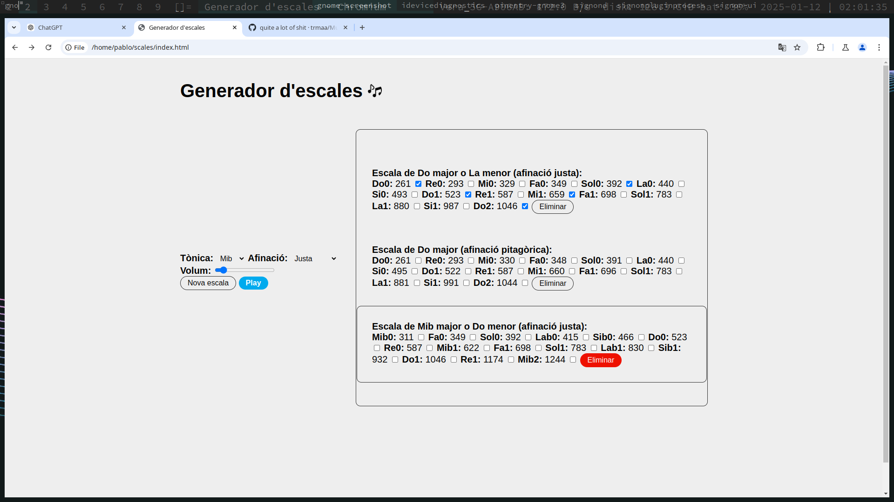

# Scale creator

It is a simple app in Català (language from a contry which neighbours France by the south at the Pirineus) which lets the user create and play musical scales in both pitagorean tunning and equal temperament at the same time.

The next step is for it to read midi using this scales... Then the counterpoints will be notable.
